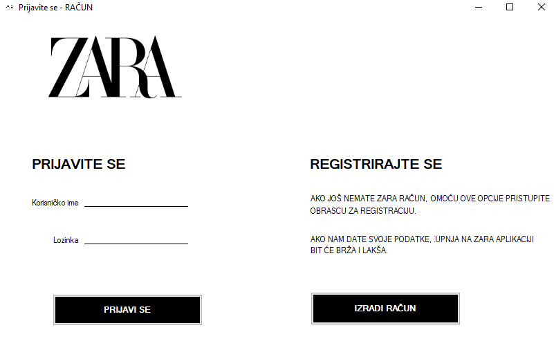
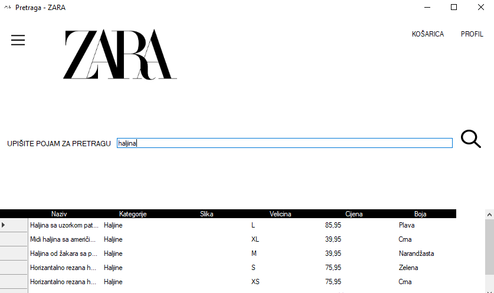
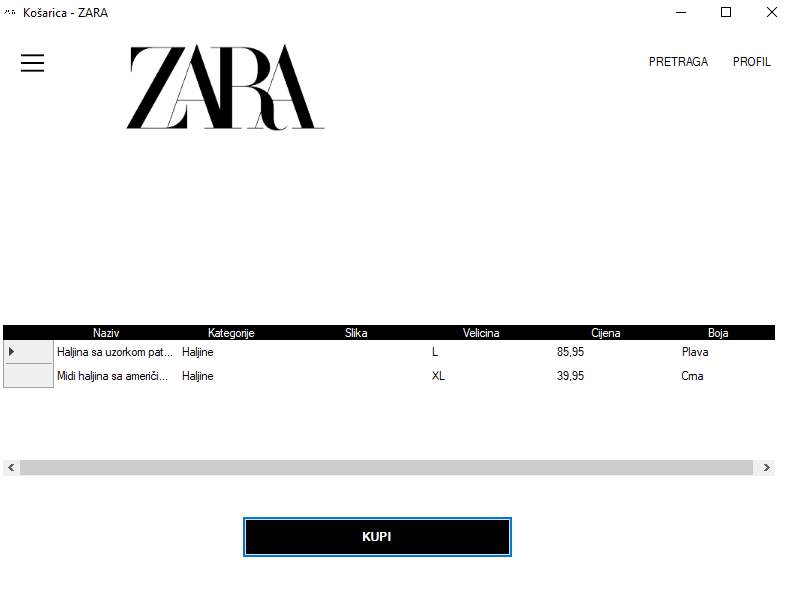
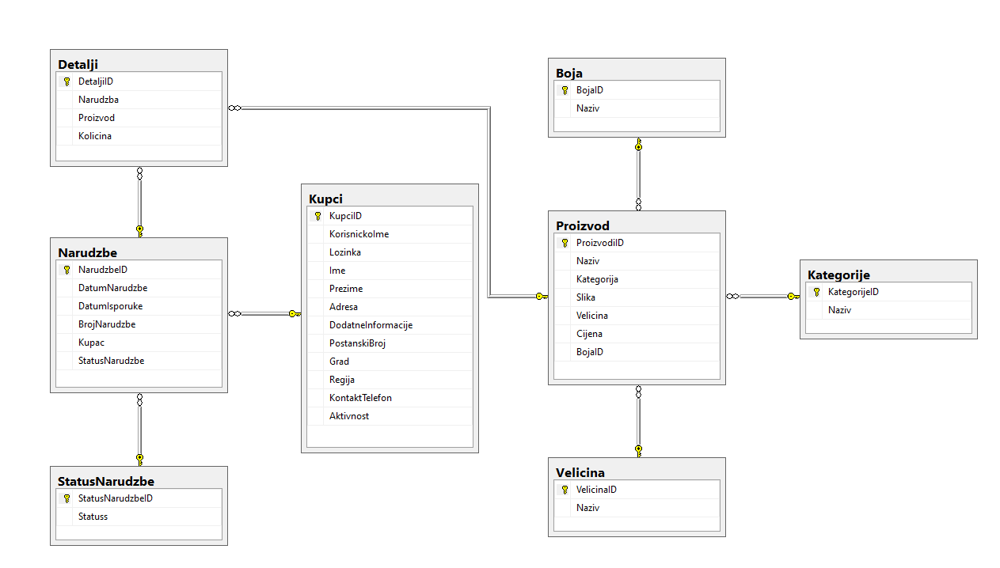

# Clothing Store – Desktop Application

A Windows desktop application for an online clothing store, built with **C#**, **Windows Forms**, **Entity Framework 6** and **SQL Server**. Customers can register, log in, browse products by category, search by name, add products to the cart, place orders and track them.

Built as a high school graduation project (*maturski rad*) at JU Srednja elektrotehnička škola Mostar, 2022.

> Educational project. The ZARA name and logo are used for demonstration only; this project is not affiliated with Inditex or ZARA.


## Features

- **Registration and login:** new account creation with input validation, and login by username and password; inactive accounts are blocked
- **Profile editing:** customers can update their personal data
- **Product catalog:** browsing products by category, with name, size, color, price and image
- **Search:** searching products by name (e.g. "haljina", "pamučni")
- **Cart and orders:** adding products to the cart and placing orders
- **Order tracking:** order list with order date, delivery date and status, and order details (products and quantities)
- **Product entry:** adding new products with images

## Screenshots

| Login | Search |
|---|---|
|  |  |

| Cart | Database (ER diagram) |
|---|---|
|  |  |

## Architecture

The solution has two projects:

- **`servis_project`** is the data access layer: an Entity Framework data model (`DM.edmx`) mapped to the SQL Server database, plus classes in the `Data` folder (`KupciDA`, `ProizvodiDA`, `NarudzbeDA`, …) that call **stored procedures** for login, insert, update and search.
- **`WindowsFormsApp22`** is the user interface: Windows Forms grouped by feature (`Kupci`, `Proizvodi`, `Narudzbe`, `Detalji`, `HOME`).

### Database

SQL Server database `zara` with the tables `Kupci` (customers), `Proizvodi` (products), `Kategorije` (categories), `Boja` (colors), `Velicina` (sizes), `Narudzbe` (orders), `Detalji` (order details) and `StatusNarudzbe` (order status), connected with foreign keys.

## Technologies

`C#` · `.NET Framework 4.7.2` · `Windows Forms` · `Entity Framework 6` · `SQL Server` · `T-SQL stored procedures` · `Visual Studio`

## How to run

Requirements: Windows, Visual Studio (with the .NET desktop development workload), SQL Server and SQL Server Management Studio.

1. **Restore the database:** in SQL Server Management Studio, right-click **Databases**, choose **Restore Database…**, select `database/zara.bak` and restore it under the name `zara`.
2. **Open the solution:** open `src/zara_app.sln` in Visual Studio. NuGet packages (Entity Framework) are restored automatically on build.
3. **Check the connection string:** in `App.config`, the connection uses the local server (`data source=.`) with Windows authentication. If your SQL Server instance has a different name (e.g. `.\SQLEXPRESS`), change it there.
4. **Run:** set `WindowsFormsApp22` as the startup project and press **F5**.

## Project structure

```
clothing-store-winforms/
├── src/
│   ├── zara_app.sln
│   ├── servis_project/        # Data access layer (Entity Framework, stored procedures)
│   └── WindowsFormsApp22/     # Windows Forms user interface
├── database/
│   └── zara.bak               # SQL Server database backup
├── docs/
│   ├── maturski-rad.pdf       # Project documentation (Bosnian)
│   └── prezentacija.pptx      # Project presentation
└── images/                    # Screenshots
```

## Author

Ajla Stranjak
